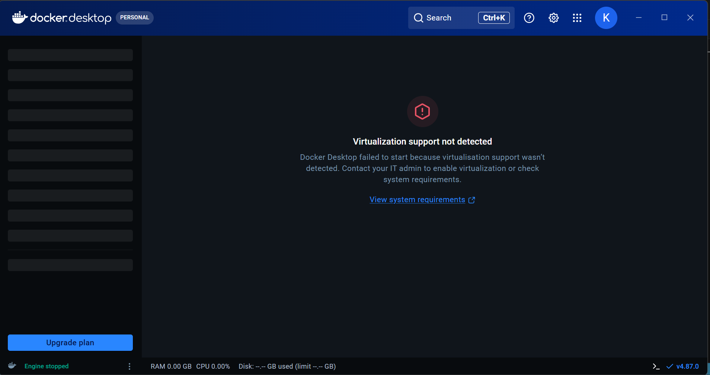

I decided to work with the message queue as my unfamiliar tool.

A message queue is an asynchronous, point-to-point communication channel used in software architecture to send messages between applications or services. Instead of Service A calling Service B directly and waiting for a response (synchronous), Service A drops a job into a queue and immediately moves on. Service B picks up the job from the queue whenever it has the processing capacity.

I learnt that docker is an open-source platform that packages an application along with all of its dependencies, libraries, and configuration files into a self-contained unit called a container. It ensures that an application runs identically across development, testing, and production environments, regardless of underlying OS differences.

I however has to use Memurai as an alternative because when attempting to run Redis via Docker Desktop on Windows, Docker required hardware-level CPU virtualization. In as much as CPU virtualization was enabled, the error was still displayed on the docker window so i had to go with the alternative.
The screenshot of the error faced is attached below

I learnt that Redis (Remote Dictionary Server) is an open-source, in-memory data structure store used primarily as a database, cache, streaming engine, and message broker.