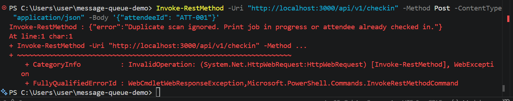

This document details the refactoring of the Kiosk Check-In service from a synchronous REST polling architecture to an event-driven, asynchronous message queue architecture utilizing BullMQ, Redis, and Webhooks.

## Deprecated Architecture Components

a. Polling Loop Removed: Deprecated the 5-minute interval `setInterval()` function and `pollWarehouseData()`        mechanism from the baseline server code.
b. Synchronous Wait Removed: The check-in route no longer awaits direct external badge printer REST responses before returning a client payload.

## New Asynchronous Architecture
1. Producer Endpoint (`POST /api/v1/checkin`)
a. State Change: Immediately updates attendee status from `NOT_CHECKED_IN` to `PENDING`.
b. Message Queue: Enqueues a job `{ attendeeId, badgeDetails, timestamp }` onto `badge-print-queue` via BullMQ/Redis.
c. Response: Returns an immediate HTTP `202 Accepted` response with status `"PENDING"`.

2. Consumer Worker (`consumer.js`)
a. Decoupled background process listening to `badge-print-queue`.
b. Simulates badge printing with a non-blocking 3-second processing delay.
c. Triggers a post-processing webhook HTTP POST callback back to the primary server upon completion.

3. Webhook Handler (`POST /api/v1/webhooks/print-status`)
a. Receives callback payload `{ attendeeId, printStatus: "SUCCESS" }`.
b. Updates attendee status from `PENDING` to `CHECKED_IN` in the primary database/state store.

## Edge Case & Race Condition Handling
a. Duplicate Scans: Rejects any check-in request if the attendee's current status is already `PENDING` or `CHECKED_IN`, returning an HTTP `409 Conflict`. Screenshot attached below 

b. Out-of-Order Webhooks: Webhook processing validates attendee existence and relies on deterministic status transitions (`PENDING` -> `CHECKED_IN`) to ensure idempotency.